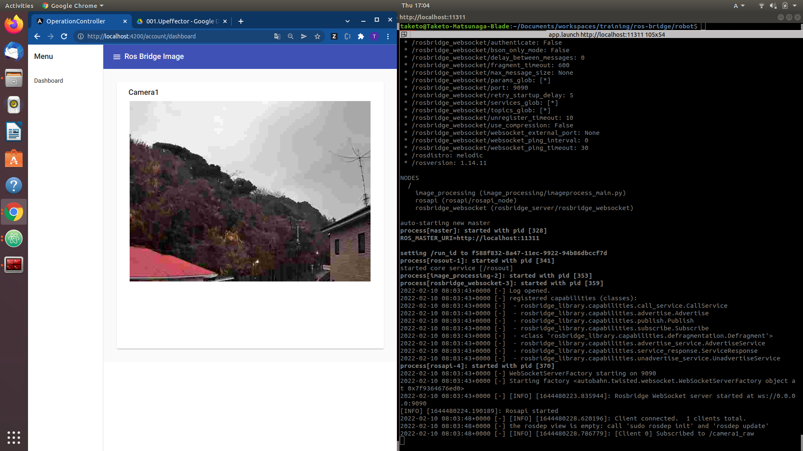

# Robot and PC Image Sharing by RosBridge

# Overview

This is an example of sharing images with ros and angular via websocket(rosbridge).

- ROS: Melodic

## Run

### Robot App

Build and run the app by following the [README](RobotApp/README.md).

### Operator App

Build and run the app by following the [README](OperatorApp/README.md).

## Reference

